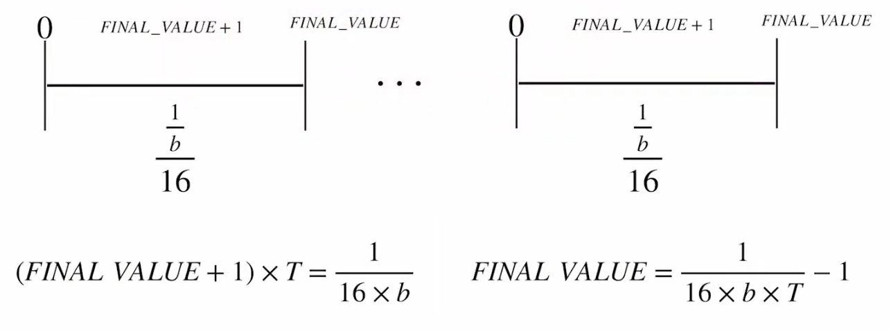

# UART Communication System (Verilog)

## 📌 Overview
This project implements a **Universal Asynchronous Receiver Transmitter (UART)** system in Verilog HDL.  
The design enables **serial communication** between an FPGA and external devices.  

---

## 📽️ Demonstration

## 📽️ Demonstration

### ▶️ Video 1 – UART Transmission

### ▶️ Video 2 – UART Reception
)

---

### ✨ Key Features
- Configurable **baud rate generator**
- **UART Receiver (RX)** with FSM-based data sampling
- **UART Transmitter (TX)** with FSM-based serial data transmission
- **FIFO buffers** for transmit and receive paths
- **Button-controlled** read/write operations
- **Debug outputs** via LEDs and 7-segment displays
- Modular **RTL design** for clarity and reusability

---

## 📂 Data Transfer in UART

UART communication follows an asynchronous serial protocol:

1. Wait for the **start bit** (logic `0`).
2. At the middle of the start bit (tick = 7), reset the counter.
3. At the middle of each data bit (tick = 15), sample and shift into a register.
4. Repeat step 3 for **N data bits**.
5. Repeat step 3 for **M stop bits**.
6. After stop bits, raise a **data ready flag**.

**Parameters:**
- **N** = number of data bits   
- **M** = number of stop bits

---

## 📐 System Architecture
The UART system is composed of the following RTL modules:

### 1. Baud Rate Generator (Timer)
- Generates sampling ticks (`s_tick`) for RX/TX modules.
- Configured for **9600 baud** (with `FINAL_VALUE = 650` for 50 MHz clock).
- Provides precise timing for serial communication.

---

### 2. UART Receiver (RX)
- Samples the **`rx`** line at each tick.  
- Detects start, data, and stop bits using an FSM.  
- Stores received data into **RX FIFO**.  
- Signals **`rx_done_tick`** when a complete byte is received.

---

### 3. UART Transmitter (TX)
- Fetches data from **TX FIFO**.  
- Serializes the byte into start bit, data bits, and stop bits.  
- Outputs the serial stream on **`tx`** line.  
- Signals **`tx_done_tick`** on transmission completion.

---

### 4. FIFO Buffers
- **RX FIFO**: Stores incoming data until read by the user.  
- **TX FIFO**: Holds data waiting to be transmitted.  
- Prevents data loss during back-to-back transfers.  
- FIFO depth is configurable via Xilinx IP (default: 16 entries).  

---

### 5. Control & User Interface
- **Push Buttons**:  
  - `wr_uart` → Write data from switches into TX FIFO.  
  - `rd_uart` → Read data from RX FIFO.  
- **Switches (SW0–SW7)**: Provide 8-bit parallel input for TX.  
- **LEDs**: Indicate FIFO **empty/full** states.  
- **7-Segment Display**: Displays transmitted/received data in hexadecimal.  

---

## 🚀 How the System Works
1. **Reception**  
   - Incoming serial data enters RX → stored in RX FIFO.  
   - On button press (`rd_uart`), data is read and displayed on 7-seg.  

2. **Transmission**  
   - User sets data on switches (SW0–SW7).  
   - On button press (`wr_uart`), data is written into TX FIFO.  
   - TX module serializes data and sends via `tx`.  

3. **Status Monitoring**  
   - LEDs indicate FIFO status (empty/full).  
   - Debugging via FPGA onboard peripherals.  

---

## ⚙️ System Parameters
| Parameter         | Value            | Notes                                |
|-------------------|------------------|--------------------------------------|
| Baud Rate         | 9600             | Configurable via `FINAL_VALUE`       |
| Data Width        | 8 bits           | Fixed for this design                |
| Stop Bits         | 1 (default)      | Can be extended                      |
| FIFO Depth        | 16 (default)     | From Xilinx FIFO IP                  |
| Clock Frequency   | 50 MHz           | Input clock for baud generator       |

---

## 🛠️ Simulation & Testing
1. **Unit Test** each RTL module:  
   - `baud_gen.v`  
   - `uart_rx.v`  
   - `uart_tx.v`  
   - `fifo.v`  

2. **Integration Test** with top-level:  
   - `terminal_demo.v` (connects RX, TX, FIFOs, and user I/O).  

3. **Hardware Verification**  
   - Program FPGA with the design.  
   - Use **serial terminal software** (Putty) on PC.  
   - Confirm loopback or direct RX/TX functionality.  

---
